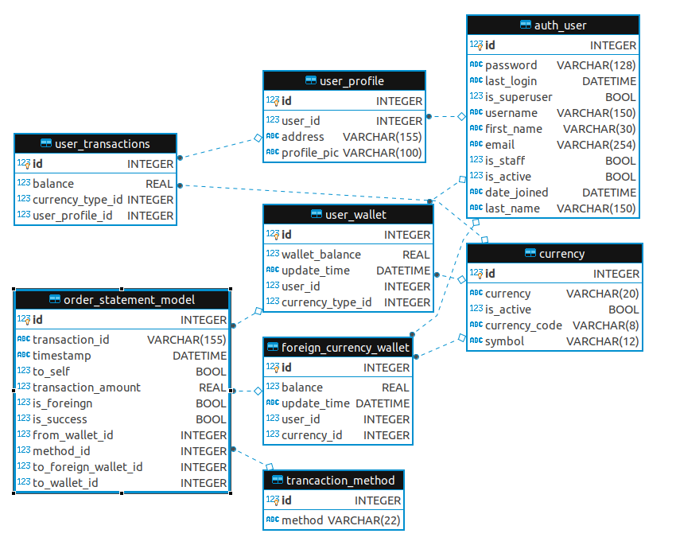

# CurrencyXchange
1) This simple project is on Currency Exchange. 
2) In this app *Userprofile* and *UserWallet* is created on user_ creation (signup), No need to create separately.
3) *Foreign currency wallet* is different from user wallet.
4) Foreign currency wallet is stored and managed in different table.

# System and specification used for development
1) Ububtu 18.04
2) Python 3.6
3) Django 3.0.3

# Installation :-
	
1) To setup virtual environment run command:
  `$ pip install virtualenv` (It may require root permission)
  `$ virtualenv ENV__NAME`
  `$ source ENV_NAME/bin/activate`

  **Your environment is activated.**

2) Install pip packages in environment.
   `$ pip install -r requirement.txt`

  **Your environmet should be activated.**

3) For database I'm using sqlite, which is deafultly available.

# API Documentation :- 
  You can find API docuentation in root folder of project **CurrencyXchange.postman_collection.json**
  **NOTE : **
  - Import this file in postman for use.
  - Import this file as collection.

# Database Schema :-
  Databse schema is available in root directory of project **database_schema.png**.
  
